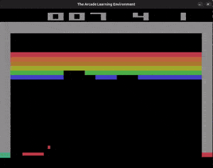
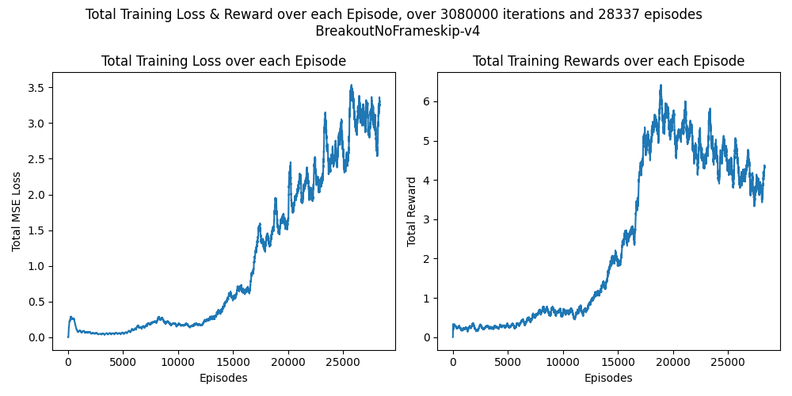

# Human-Level Performance of DQN in Breakout

# Abstract 

# Introduction

# Methodologies

## Q-Learning
**Q-learning** is one of the popular algorithms used in RL, since it can be used in model-free setups (both for evaluation and improvement) and it's also off-policy; meaning that we can make use of the expreinces from a given policy (namely the *behaviour policy*), to improve a desired *target policy*. The formula for the algorithm is as follows:

$
Q(s, a) \leftarrow Q(s, a) + \alpha \left( r + \gamma \max_{a'} Q(s', a') - Q(s, a) \right) \space \text{eq.1}
$

(where a is chosen from the *behaviour policy* and $ a' $ is chosen from the *target policy*. Also note that $ r + \gamma \max_{a'} Q(s', a') $ is usually called the target value)

## Deep Reinforcement Learning
Only having **Q-learning** algorithm doesn't do any good for us, unless we are working with a very simple environment. since in most of the cases we are dealing with an environment with a large state space and action space, we can represent **action-value** (or sometimes called $\bold{Q-values}$) for each state-action pair in a table, hence we need some other approach to store, represent, and also learn $\bold{Q-values}$, for that we can use function approximation methods; one of the most used methods today is to use neural netowrks to approximate the $\bold{Q-values}$. Hence, neural networks (if the appropriate architecture used, and tuned correctly) are provide us a way to approximate our $\bold{Q-values}$.

The neural network that we have used in our work is explained in detail in [Image Processing Network](#image-processing-network) section.

## Image Processing Network
Since our work is on a **Atari** game, for processing frame, we need to use a [CNN](https://en.wikipedia.org/wiki/CNN). The specifications of the **CNN** we used is as follows:

1. First layer: a convolutional layer with input channel of 4, number of filters of 32 and kernel size of (8, 8), with an stride of 4, followed by a reLU.

2. Second layer: a convolutional layer with input channel of 32, number of filters of 64 and kernel size of (4, 4), with an stride of 2, followed by a reLU.

3. Third layer: a convolutional layer with input channel of 64, number of filters of 64 and kernel size of (3, 3), with an stride of 1, followed by a reLU and then a flattening.

4. Forth layer: a fully connected layer with input features of size 3136, output features of size 512, followed by a reLU.

5. Fifth and the last layer: a fully connected layer with input features of size 512, output features of size 4.

## DQN Algorithm 
Before diving into the **DQN** algorithm, we need to define a few things first: 

### Replay Buffer
As we said earlier, the **Q-learning** algorithm could be used in a **off-policy** setting, that means we can utilize the experinces that we have had from other policies in our work to improve our current policy. In other words, we can make use of our previous expreinces in the game (which have been caused by our previous policies) to train our agent again, and again. This technique is called is done using a **Replay Buffer** which is essentially a storage of our previous expreinces (which are of the form $ e_t = (s_t, a_t, r_t, s_{t+1}) $). More specifically, while we are interacting with the environment, we can sample a mini-batches of our previous expreinces from the **Replay Buffer** and improve our policy.    

Our **Replay Buffer** is of size 50000 expreinces, and we sample mini-batches of size 32 from it. We don't take sample mini-bathces for the first few interactions of the agent with the environment (namely this is called the warm-up phase).

### Target Network & Q-Network
In order to stablize the learning, we use two different networks (these two networks are the same expect for their weights. the target network weights get updated less frequently):

- **Q-Network**: This is the primary network that we want to use in our work to pick the best actions while the agent is interacting with the environment. We will denote this network by $ Q $ and its weights by $ \theta $

- **Target Network**: This network will be used when we want to approximate the target value (defined in [Q-Learning](#q-learning) section in eq.1). The weights of this network are updated less frequently in order to stablize our algorithm. We will denote this network by $ \hat{Q} $ and its weights by $ \theta^- $

### $ \epsilon $-greedy policy
Since [Exploration-Exploiation](https://en.wikipedia.org/wiki/Exploration%E2%80%93exploitation_dilemma) is one of the main issues of Reinforcement Learning algorithms which are based on **Value-Iteration**, we consider an decaying variable (most of the times called $ \epsilon $) which controls the probability of taking a random action while interacting with the environment to help the agent explore the environment good enough to be able to have a successful exploitation phase later on. 

We will explain how exactly we will use the decaying $ \epsilon $ in our work in [DQN Algorithm](#dqn-algorithm) section, but here we will provide the specifications of how we initialize and decay $ \epsilon $: 

initialization value: $ 1.0 $, final value: $ 0.1 $, the number of frames used to decay: $ 10^6 $ (we decay the $ \epsilon $ linearly).  

### Optimizer
We will use RMSprop as the optimizer for this work, for details on hyperparamters please refer to [Appendix](#appendix) section.

### Pseudocode
The following is the pseudocode of the **DQN** algorithm:

$
\text{Initialize replay memory } D \text{ to capacity } N \\
\text{Initialize action-value function } Q \text{ with random weights } \theta \\
\text{Initialize action-value function } Q' \text{ with weights } \theta^- = \theta\\
\text{For each episode:} \\
\quad \text{Initialize sequence } s_1 = \{x_1\} \text{ and preprocessed sequence } \phi_1 = \phi(s_1) \\
\quad \text{For } t = 1 \text{ to } T: \\
\quad \quad \text{With probability } \epsilon \text{ select a random action } a_t \\
\quad \quad \text{Otherwise select } a_t = \arg\max_a Q(\phi_t, a; \theta) \\
\quad \quad \text{Execute action } a_t \text{ and observe reward } r_t \text{ and new image } x_{t+1} \\
\quad \quad \text{Set } s_{t+1} = s_t, a_t, x_{t+1} \text{ and preprocess } \phi_{t+1} = \text{process}(s_{t+1}) \\
\quad \quad \text{Store transition } ( \phi_t, a_t, r_t, \phi_{t+1} ) \text{ in } D \\
\quad \quad \text{Sample random minibatch of transitions } ( \phi_j, a_j, r_j, \phi_{j+1} ) \text{ from } D \\
\quad \quad \text{Set } y_j = 
  \begin{cases}
    r_j & \text{if episode terminates at step } j+1 \\
    r_j + \gamma \max_{a'} \hat{Q}(\phi_{j+1}, a'; \theta^-) & \text{otherwise}
  \end{cases} \\
\quad \quad \text{Perform a gradient descent step on } (y_j - Q(\phi_j, a_j; \theta))^2 \\
\quad \text{Every C steps reset } \hat{Q} = Q \\
\text{End For}
$

# Preprocesing

# Results
The training loss & reward over 3 million iterations and about 3 thousand episodes is shown in the figure below:

As it's shown in the figure, we have reached a maximum of 6 as the mean reward in episdoes about 17500 and then started to diverged from there onwards. 

Though the best model we got in our evaluations was in the eposidoe 21565 and the iteration 1880000 with a mean reward of 7.9 per episode.

# Conclusion

# Appendix